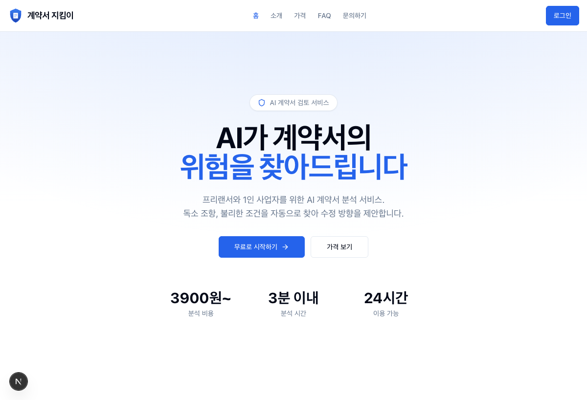
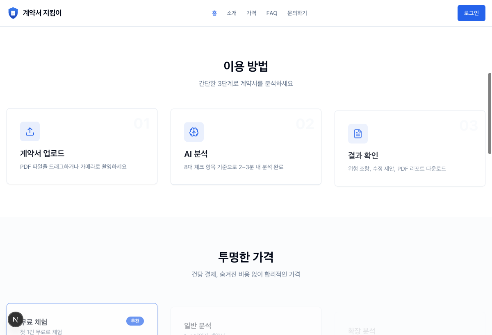
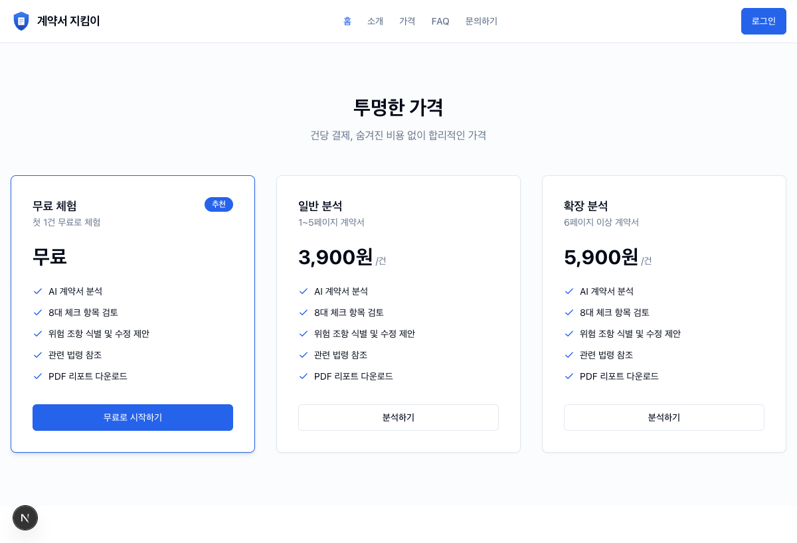
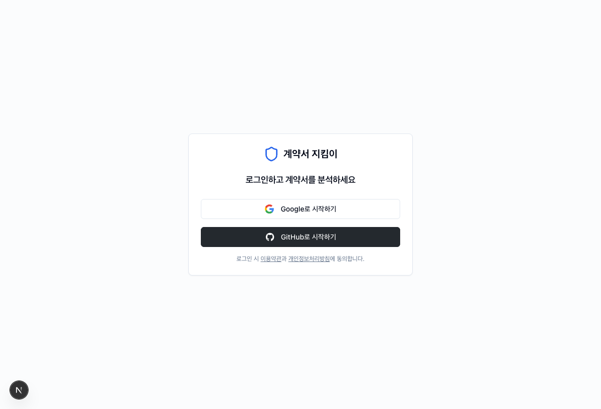

<div align="center">

```
  ██████╗ ██████╗ ███╗   ██╗████████╗██████╗  █████╗  ██████╗████████╗
 ██╔════╝██╔═══██╗████╗  ██║╚══██╔══╝██╔══██╗██╔══██╗██╔════╝╚══██╔══╝
 ██║     ██║   ██║██╔██╗ ██║   ██║   ██████╔╝███████║██║        ██║
 ██║     ██║   ██║██║╚██╗██║   ██║   ██╔══██╗██╔══██║██║        ██║
 ╚██████╗╚██████╔╝██║ ╚████║   ██║   ██║  ██║██║  ██║╚██████╗   ██║
  ╚═════╝ ╚═════╝ ╚═╝  ╚═══╝   ╚═╝   ╚═╝  ╚═╝╚═╝  ╚═╝ ╚═════╝   ╚═╝

   ██████╗ ██╗   ██╗ █████╗ ██████╗ ██████╗ ██╗ █████╗ ███╗   ██╗
  ██╔════╝ ██║   ██║██╔══██╗██╔══██╗██╔══██╗██║██╔══██╗████╗  ██║
  ██║  ███╗██║   ██║███████║██████╔╝██║  ██║██║███████║██╔██╗ ██║
  ██║   ██║██║   ██║██╔══██║██╔══██╗██║  ██║██║██╔══██║██║╚██╗██║
  ╚██████╔╝╚██████╔╝██║  ██║██║  ██║██████╔╝██║██║  ██║██║ ╚████║
   ╚═════╝  ╚═════╝ ╚═╝  ╚═╝╚═╝  ╚═╝╚═════╝ ╚═╝╚═╝  ╚═╝╚═╝  ╚═══╝
```

# 계약서 지킴이

### AI-Powered Contract Review for Freelancers

**Upload &bull; Analyze &bull; Protect**

[](https://nextjs.org/)
[](https://react.dev/)
[](https://supabase.com/)
[](https://anthropic.com/)
[](https://www.typescriptlang.org/)

[](https://turbo.build/)
[](https://pnpm.io/)
[](https://www.docker.com/)
[-000020?style=flat-square&logo=expo&logoColor=white)](https://expo.dev/)

<br />

> *프리랜서와 소규모 사업자를 위한 AI 계약서 분석 플랫폼.*
> *계약서를 업로드하면 Claude AI가 8개 항목을 분석하고, 위험도를 점수화하며, PDF 리포트를 생성합니다.*

<br />

</div>

---

## Screenshots

<table>
<tr>
<td align="center" width="50%">
<strong>Landing Page</strong><br/>

</td>
<td align="center" width="50%">
<strong>How It Works</strong><br/>

</td>
</tr>
<tr>
<td align="center" width="50%">
<strong>Pricing</strong><br/>

</td>
<td align="center" width="50%">
<strong>Login</strong><br/>

</td>
</tr>
</table>

---

## Overview

프리랜서 계약에서 불리한 조항을 놓치고 있지 않으신가요? **계약서 지킴이**는 계약서를 업로드하면 Claude AI가 8개 핵심 조항을 분석하고 위험도를 점수화해주는 서비스입니다.

```
┌──────────────────────────────────────────────────────────────────┐
│                                                                  │
│   계약서 업로드  →  텍스트 추출  →  결제  →  AI 분석  →  PDF 리포트  │
│   (PDF/JPEG/PNG)    (자동)       (Toss)   (Claude)    (다운로드)   │
│                                                                  │
└──────────────────────────────────────────────────────────────────┘
```

### Why Contract Guardian?

- **8개 핵심 조항 분석** — 대금, 업무 범위, 지식재산권, 해지, 하자보증, 비밀유지, 손해배상, 분쟁 해결
- **위험도 점수화** — 0~100 점수로 계약의 위험 수준을 직관적으로 표시
- **PDF 리포트** — 분석 결과를 전문적인 PDF 보고서로 다운로드
- **스캔 문서 지원** — PDF 텍스트 추출 + 이미지 모드로 스캔 문서도 분석 가능
- **첫 1회 무료** — 부담 없이 서비스를 체험

---

## Analysis Categories

| Category | Description | What AI Checks |
|----------|------------|----------------|
| Payment Terms | 대금/보수 지급 조건 | 지급 시기, 방법, 지연 이자 |
| Scope of Work | 업무 범위 명확성 | 범위 정의, 변경 절차, 추가 비용 |
| Intellectual Property | 지식재산권 귀속 | 저작권 귀속, 라이선스, 사용 범위 |
| Termination | 계약 해지 조건 | 해지 사유, 통보 기간, 정산 방식 |
| Warranty | 하자보증 책임 | 보증 기간, 범위, 면책 조건 |
| Confidentiality | 비밀유지 조항 | 범위, 기간, 위반 시 제재 |
| Liability | 손해배상 한도 | 배상 한도, 면책, 간접 손해 |
| Dispute Resolution | 분쟁 해결 방법 | 관할 법원, 중재/조정, 준거법 |

---

## Architecture

```
┌───────────────────────────────────────────────────────────────────┐
│                         Monorepo (pnpm + Turbo)                  │
│                                                                   │
│  ┌─────────────┐  ┌─────────────┐                                │
│  │  apps/web   │  │ apps/mobile │  (Phase 2)                     │
│  │  Next.js 16 │  │  Expo 52    │                                │
│  └──────┬──────┘  └─────────────┘                                │
│         │                                                         │
│  ┌──────┴──────────────────────────────────────────┐             │
│  │              Shared Packages                     │             │
│  │  @cg/shared  │  @cg/api  │  @cg/ui  │  @cg/config │           │
│  └──────────────────────────────────────────────────┘             │
└───────────────────────────────────────────────────────────────────┘
         │                    │                    │
         ▼                    ▼                    ▼
┌─────────────┐    ┌──────────────┐    ┌──────────────────┐
│  Supabase   │    │  Claude AI   │    │  Toss Payments   │
│  (DB/Auth/  │    │  (Contract   │    │  (Payment        │
│   Storage)  │    │   Analysis)  │    │   Processing)    │
└─────────────┘    └──────────────┘    └──────────────────┘
```

### FSD (Feature-Sliced Design)

```
app/            → Next.js pages (thin wrappers)
  _pages/       → Page compositions
    widgets/    → Composite UI blocks (header, footer, sections)
      features/ → Business logic (upload, analysis, payment, auth)
        entities/   → Domain models (analysis, payment)
          shared/   → Utilities (supabase, auth, rate-limit)
```

### Analysis Status Flow

```
pending_payment ──▶ paid ──▶ processing ──▶ completed
                                    │
                                    └──▶ failed
```

---

## Pricing

| Plan | Price | Condition |
|------|-------|-----------|
| Free | ₩0 | 첫 1회 무료 |
| Standard | ₩3,900 | 5페이지 이하 |
| Extended | ₩5,900 | 6페이지 이상 |

---

## Quick Start

### Prerequisites

- **Node.js** 18+
- **pnpm** 9.15+
- **Supabase CLI** (optional, for local DB)

### 1. Clone & Install

```bash
git clone https://github.com/sgd122/contract-guardian.git
cd contract-guardian
pnpm install
```

### 2. Environment Setup

```bash
cp .env.example .env
```

| Variable | Description |
|----------|------------|
| `SUPABASE_URL` | Supabase project URL |
| `SUPABASE_ANON_KEY` | Supabase public key |
| `SUPABASE_SERVICE_ROLE_KEY` | Supabase service role key (server only) |
| `ANTHROPIC_API_KEY` | Claude API key |
| `TOSS_CLIENT_KEY` | Toss Payments client key |
| `TOSS_SECRET_KEY` | Toss Payments secret key |

### 3. Run

```bash
# Option A: Local development
supabase start        # Start local Supabase
pnpm db:generate      # Generate DB types
pnpm dev:web          # Start Next.js (localhost:3000)

# Option B: Docker (full stack)
cp .env.docker .env
docker compose up -d --build
```

| Service | URL |
|---------|-----|
| Web App | http://localhost:3000 |
| Supabase API | http://localhost:54321 |
| Supabase Studio | http://localhost:54323 |
| Email Test (Inbucket) | http://localhost:54324 |

---

## Monorepo Structure

```
contract-guardian/
├── apps/
│   ├── web/              # Next.js 16 web app (@cg/web)
│   └── mobile/           # Expo 52 mobile app (@cg/mobile) — Phase 2
├── packages/
│   ├── shared/           # Types, constants, Zod schemas (@cg/shared)
│   ├── api/              # API client, Supabase services, hooks (@cg/api)
│   ├── ui/               # Radix + animated components (@cg/ui)
│   └── config/           # Shared tsconfig, ESLint, Tailwind (@cg/config)
├── docker/               # Kong config, DB init scripts
├── supabase/             # Local dev config & migrations
├── Dockerfile            # Multi-stage build (dev/builder/runner)
├── docker-compose.yml    # Dev environment (with Supabase)
└── docker-compose.prod.yml  # Production environment
```

---

## API Routes

| Method | Route | Description |
|--------|-------|------------|
| `POST` | `/api/upload` | File upload + text extraction |
| `POST` | `/api/analyze/[id]` | Trigger Claude analysis |
| `GET` | `/api/analyses/[id]` | Get analysis result |
| `POST` | `/api/payment/confirm` | Confirm payment |
| `POST` | `/api/payment/webhook` | Toss payment webhook |
| `GET` | `/api/report/[id]` | Download PDF report |
| `GET` | `/api/auth/callback` | OAuth callback |
| `POST` | `/api/consent` | Privacy consent tracking |

---

## Tech Stack

| Layer | Technology |
|-------|-----------|
| Framework | [Next.js 16](https://nextjs.org/) (App Router) + [React 19](https://react.dev/) |
| Mobile | [Expo 52](https://expo.dev/) + React Native (Phase 2) |
| Database | [Supabase](https://supabase.com/) (PostgreSQL, Auth, Storage, RLS) |
| AI | [Claude API](https://docs.anthropic.com/) (`claude-sonnet-4-20250514`) |
| Payment | [Toss Payments](https://developers.tosspayments.com/) |
| Build | [pnpm workspaces](https://pnpm.io/) + [Turborepo](https://turbo.build/) |
| Styling | [Tailwind CSS 3.4](https://tailwindcss.com/) + [Radix UI](https://www.radix-ui.com/) |
| Animation | [Motion](https://motion.dev/) (Framer Motion) |
| Deploy | [Docker](https://www.docker.com/) (multi-stage) |
| Monitoring | [Sentry](https://sentry.io/) (optional) |
| Rate Limit | [Upstash Redis](https://upstash.com/) (with in-memory fallback) |

---

## Security

| Feature | Description |
|---------|------------|
| Authentication | `requireAuth()` on all protected routes |
| Row Level Security | Supabase RLS for data isolation |
| Rate Limiting | Redis-based (Upstash) + in-memory fallback |
| CORS | Origin restriction middleware |
| Security Headers | CSP, HSTS, X-Frame-Options |
| Webhook Verification | HMAC-SHA256 signature check |
| PII Filtering | Allowlist-based before DB storage |
| Audit Logging | File upload/download, payment, account events |
| Consent Verification | Privacy policy check before file processing |
| Auto Deletion | 90-day auto-delete via `pg_cron` |
| Magic Bytes | Upload file type verification |

---

## Scripts

```bash
# Development
pnpm dev              # All dev servers (Turbo)
pnpm dev:web          # Web app only
pnpm dev:mobile       # Mobile app only

# Build & Check
pnpm build            # Full build
pnpm typecheck        # Type check
pnpm lint             # ESLint

# Database
pnpm db:generate      # Generate Supabase types
pnpm db:migrate       # Apply migrations

# Docker
pnpm docker:dev:build # Build & start dev (with Supabase)
pnpm docker:dev:down  # Stop dev environment
pnpm docker:prod:build # Build production image
pnpm docker:clean     # Clean all (including volumes)
```

---

## Pages

| Route | Description | Auth |
|-------|------------|------|
| `/` | Landing page | - |
| `/login` | Authentication | - |
| `/dashboard` | Analysis history | Required |
| `/analyze` | Upload & start analysis | Required |
| `/analyze/[id]` | Analysis result detail | Required |
| `/payment-history` | Payment records | Required |
| `/settings` | Account settings | Required |
| `/pricing` | Pricing plans | - |
| `/about` | About the service | - |
| `/help` | FAQ & Help | - |
| `/terms` | Terms of Service | - |
| `/privacy` | Privacy Policy | - |

---

## Contributing

Contributions are welcome! Feel free to open issues and pull requests.

1. Fork the repository
2. Create your feature branch (`git checkout -b feature/amazing-feature`)
3. Commit your changes (`git commit -m 'Add amazing feature'`)
4. Push to the branch (`git push origin feature/amazing-feature`)
5. Open a Pull Request

---

## License

Private - All rights reserved.

---

<div align="center">

**Built with Claude AI**

*Protecting freelancers, one contract at a time.*

[](https://anthropic.com/)

</div>
